<!-- Add this anywhere in your Markdown file -->
<script src="https://cdn.jsdelivr.net/npm/mermaid@10/dist/mermaid.min.js"></script>
<script>
  mermaid.initialize({ startOnLoad: true });
</script>

<!-- _footer: - -->


---

<!-- _footer: - -->

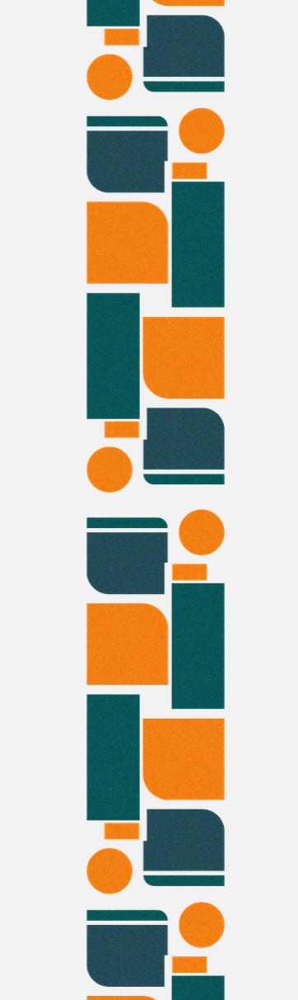

<div style="height: 50vh">

# CS Teacher VPL Tricks

### *Half your time checking student programs while doubling student engagement with Moodle VPL*

<!-- sub sub title: Super Sulit Server Setup with Linode Akamai (and Nephila)   -->

</div>

<hr>
<p class="w3-text-deep-orange w3-bold"> Presented By:
</p>
Roy Vincent L. Canseco, MSEE, PhD Cand. CS <br>
Computer Science Unit /  MIS <br>
Philippine Science High School - Main Campus

<div class="w3-right">


</div>

---


<div class="w3-row">
<div class="w3-col s8">

# Teacher and I.T. Practitioner 

<div class="w3-xlarge">
<p>I have had the privilege of teaching at various institutions, including the Institute of Electrical and Electronics Engineering (IEEE), the Department of Computer Science (DCS) and the Virata School of Business  at the University of the Philippines Diliman (UPD). During my time at UPD, I actively contributed to the development of UPD's Moodle-based UVLe LMS as a Project Development Associate.
</p>


Currently, I am teaching at Philippine Science High School - Main Campus, where I served as the head of the Information Technology Unit (MIS) during the deployment of our Moodle-based Learning Management System called KHub.
</div>

</div>
<div class="w3-col s4 w3-center">


<hr>

<div class="w3-right">
Roy Canseco 
<p class="w3-xlarge"> 
CS Teacher , MIS - PSHS-MC
</p>
</div>


</div>
</div>

---


# Talk Description

Join me as I share how our campus set up and leverages Moodle's Virtual Programming Laboratory (VPL), along with generative AI to heighten student engagement, while minimizing code checking time. 

Discover how we have implemented these technologies to enhance the learning experience, while keeping server costs cheap and maintenance easy. 


---

<!-- _footer: - -->


<div class="w3-xxlarge w3-uppercase">

# CS Teacher VPL Tricks

</div>

### MoodleMoot 2024

#### May 2024

<br>

##### Roy Vincent L. Canseco


---


# Talk Outline


<div class="mermaid w3-center">
timeline
    Background : A key challenge to CS Teachers
    Big Idea : VPL 
    : AI chatbot (eg Copilot)
    Advantages : Auto Program checking 
    : Anti Plagiarism tools
    : Multi-language support
    Setup : Moodle VPL plugin
    : **Execution Server**
</div>


---

<!-- _footer: _ -->
<!-- paginate: true -->


According to a study funded by Google, under the direction of ACM, and in partnership with Microsoft:
<br>

<div class="w3-xxxlarge">

> "Computer science educators often struggle with limited access to **up-to-date materials**, **software**, and **hardware**"
> <span class="w3-right"> -University of Chicago Study </span>

</div>

<div class="w3-bottom w3-medium">
1) Century et al. 2013. Building an Operating System report. https://outlier.uchicago.edu/computerscience/OS4CS/challenges/. Accessed 2024
2) Doug Konopelko. 2024. Building an Operating System report. https://outlier.uchicago.edu/computerscience/OS4CS/challenges/. Accessed 2024
</div>

---


<div class="w3-container w3-black w3-center" style="position: absolute; top: 50; left: 50;">
  <p class="w3-text-white" style="font-size: 50px; font-family: 'Courier New', monospace;">01</p>
</div>


<div class="w3-display-middle w3-jumbo">
  VPL - Virtual Programming Laboratory
</div>


---


<div class="w3-row"> 
  <div class="w3-col s5">

  # Virtual Programming Laboratory

  </div>
  <div class="w3-col s7">
  <div class="mermaid w3-center">
  graph LR
    MoodleVPL[Moodle VPL] --> InteractiveProgramming["Interactive      Programming      Assignments"]
    MoodleVPL --> WebBasedEnvironment["Web-Based Programming Environment"]
    MoodleVPL --> SecureSandbox["Secure Sandbox Environment"]
    MoodleVPL --> MultipleLanguages["Support for Multiple Programming Languages"]
    MoodleVPL --> AutomaticGrading["Automatic Grading and Feedback"]
    MoodleVPL --> PlagiarismChecker["
  Plagiarism Checker"]

  </div>
  </div>

</div>

---

<!-- _footer: - -->


<div class="w3-center w3-xxlarge w3-text-green">

 Interactive Secure Web-based Environment 
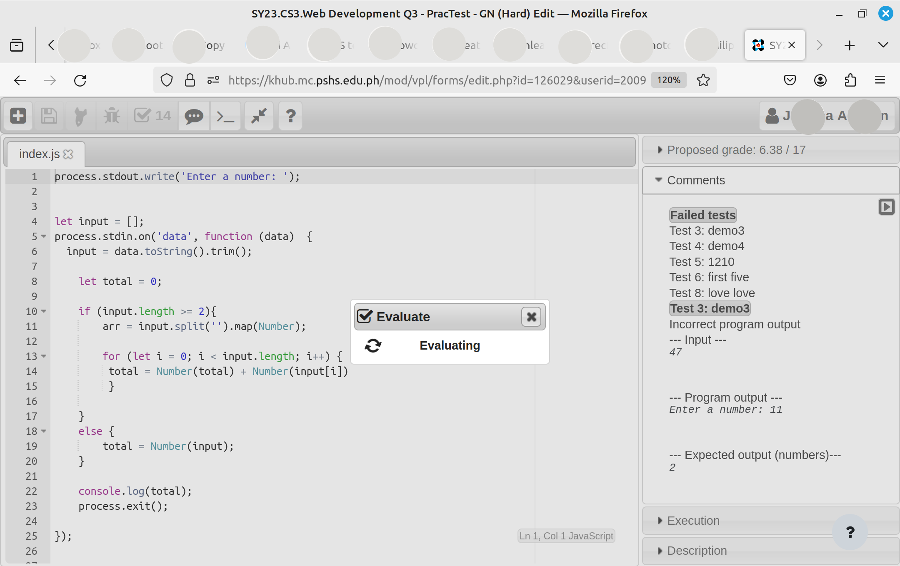
</div>

---


<div class="w3-center w3-xxlarge w3-text-green">

 Automatic Code Similarity Checker 
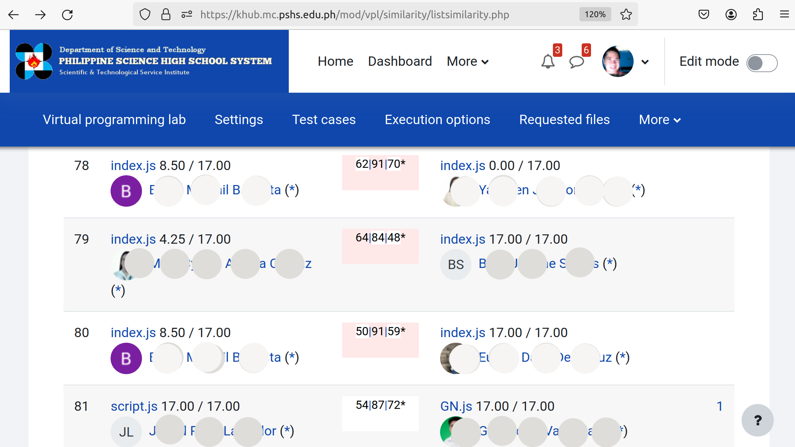
</div>

---


<div class="w3-center w3-xxlarge w3-text-green">

 Easy Code Comparison
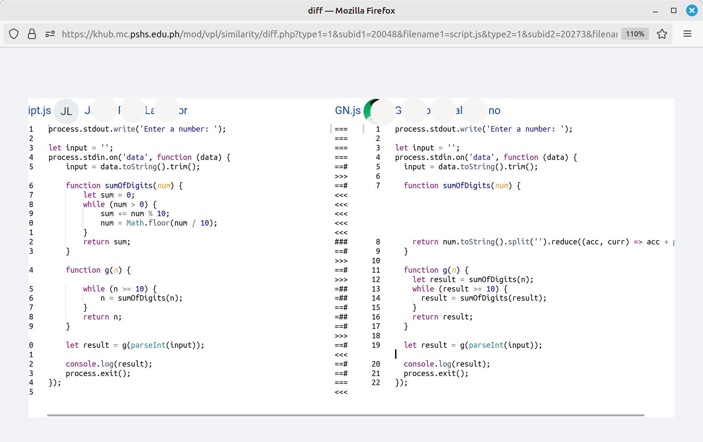
</div>

---


<div class="w3-rows">

<div class="w3-col s4">

# Lots of **Programming Languages** supported

\*\* there are more depending on the setup

</div>

<div class="w3-col s8 w3-center">

<div class="mermaid">
mindmap
  root(("Available <br> Languages"))
    **C**
    **C++**
    Java
    ::icon(fa-brands fa-java)
    Python
    ::icon(fab fa-python)
    PHP
    ::icon(fa-brands fa-php)
    Javascript
    ::icon(fa-brands fa-js)
    **Ruby**
    **Perl**
    Swift
    ::icon(fa-brands fa-swift)
    **Matlab**
    **R**
    **Shell**

</div>

</div>

---

<!-- _footer: - -->


<div class="w3-center w3-xxlarge w3-text-green">

Supported Programming Languages

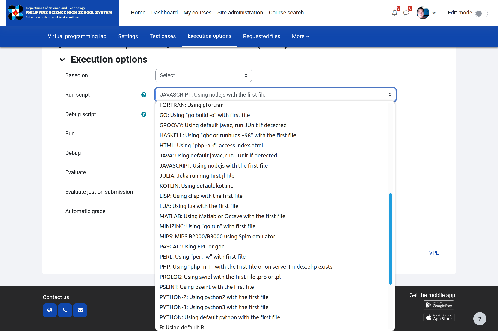

</div>


---


<div class="w3-container w3-black w3-center" style="position: absolute; top: 50; left: 50;">
  <p class="w3-text-white" style="font-size: 50px; font-family: 'Courier New', monospace;">02</p>
</div>


<div class="w3-display-middle w3-jumbo">
  Recent Studies on A.I. for Computer Science Education
</div>


---


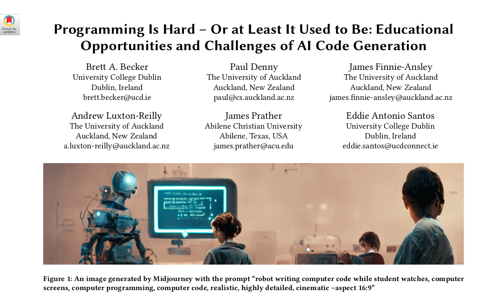

---


<!-- _footer: Becker, B. A., Denny, P., Finnie-Ansley, J., Luxton-Reilly, A., Prather, J., & Santos, E. A. (2023). Programming Is Hard – Or at Least It Used to Be: Educational Opportunities and Challenges of AI Code Generation. In Proceedings of the 54th ACM Technical Symposium on Computer Science Education V. 1 (SIGCSE 2023), March 15–18, 2023, Toronto, ON, Canada. https://doi.org/10.1145/3545945.3569759 -->


<div class="w3-container w3-white w3-opacity w3-xxlarge">

  Becker et al, in 2023, discussed ways in which AI tools can  help students learn programming:

1. **AI-generated solutions** can provide students with model answers to programming exercises
2. AI can generate **explanations of complex code**
3. Educators can leave low-level code to A.I. then **shift the focus to algorithms** 
4. AI-generated starter code can help students **combat programmer's writer's block**

</div>


---


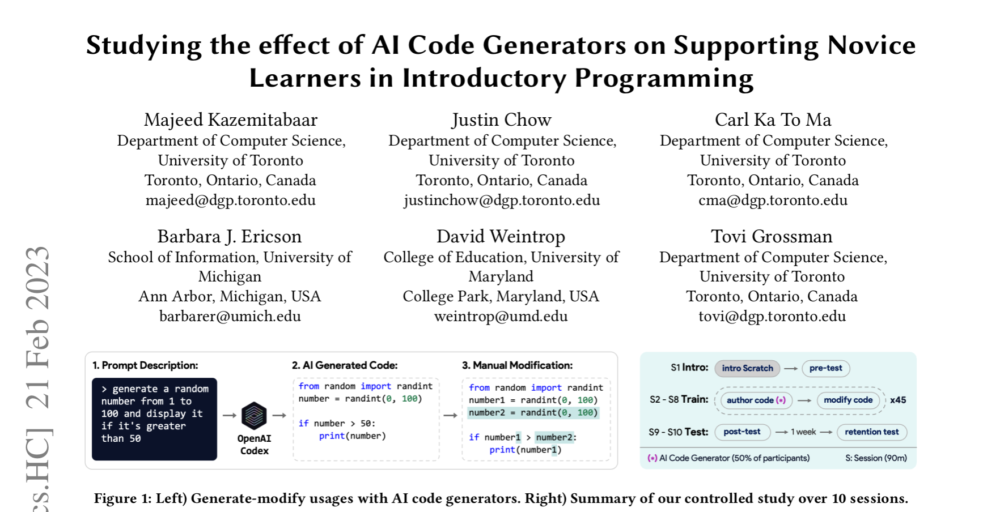

---


<!-- _footer: Kazemitabaar, M., Chow, J., Ma, C. K. T., Ericson, B. J., Weintrop, D., & Grossman, T. (2023). Studying the Effect of AI Code Generators on Supporting Novice Learners in Introductory Programming. In Proceedings of the 2023 CHI Conference on Human Factors in Computing Systems (CHI ’23), April 23–28, 2023, Hamburg, Germany.  https://doi.org/10.1145/3544548.3580919 -->


<div class="w3-container w3-white w3-opacity w3-xlarge">

  In a 2023 study that involved 69 novices aged 10-17, Kazemitabaar et al presented encouraging evidence that AI Coding Assistants can be integrated into programming education:

1. Students using AI code generators like Codex showed **completed tasks faster and with higher scores**,
2. Students with higher pre-test scores and access to Codex performed significantly **better in retention tests**
3. Students using AI code generators felt **less stressed and more eager** to continue learning programming 
4. Students used AI code generators to **break tasks into subgoals** and solve each subgoal step by step

</div>


---


---


<!-- _footer: itria, T. N. (2021). Artificial intelligence (AI) in education: Using AI tools for teaching and learning process. Prosiding Seminar Nasional & Call for Paper STIE AAS, Surakarta, Jawa Tengah -->


<div class="w3-container w3-white w3-opacity w3-xxlarge">

  Fitria, in 2021, highlights the following aspects of A.I. for education:

1. Students can have a more **Personalized Learning** experience with AI
2. A.I. will be **Complementing Teachers**
3. AI Applications can serve as **Virtual mentors / tutors** 
4. A.I. carries potential technical issues like **cyberattacks and plagiarism.**

</div>


---


<div class="w3-container w3-black w3-center" style="position: absolute; top: 50; left: 50;">
  <p class="w3-text-white" style="font-size: 50px; font-family: 'Courier New', monospace;">03</p>
</div>


<div class="w3-display-middle w3-jumbo">
  VPL Secure and Cost-Effective Setup
</div>


---


# VPL Setup and Use

1. **_Install VPL plugin_** - Installing Moodle VPL is a straightforward process that involves uploading the plugin package and configuring the settings.

2. **_Setup VPL Jail Server_** - Involves setting up a dedicated server, installing the necessary packages, configuring the server, and testing the installation.

3. **_Create VPL Assignments_** - Creating VPL assignments involves careful planning, designing, and testing to ensure they align with learning objectives and effectively assess programming skills.

---

## VPL Plugin

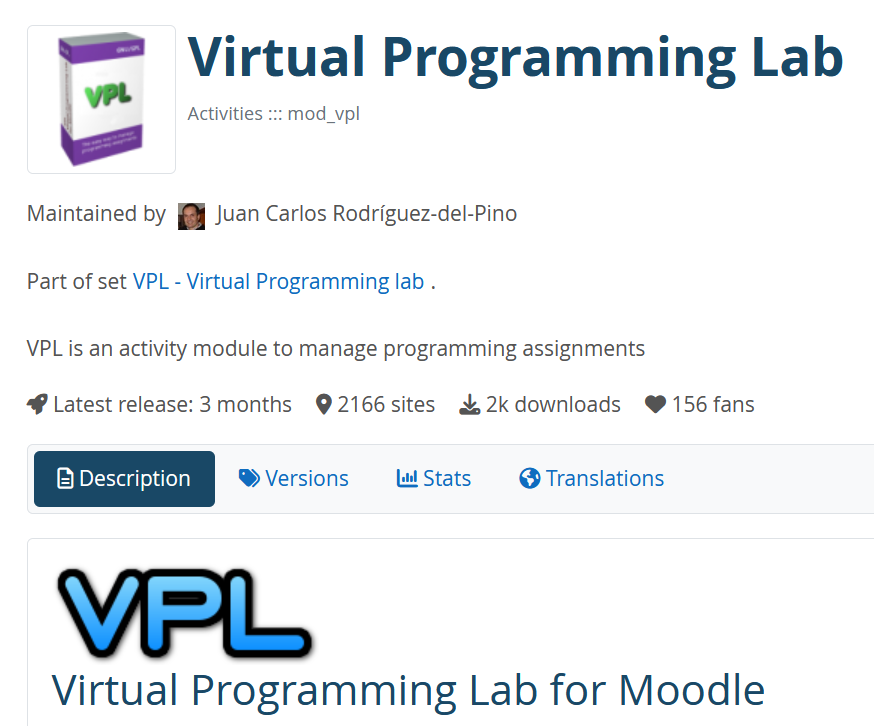

* Program in the browser.
* Run tests to grade the programs.
* Check for file similarity.
* Restrict copy-pasting.


<!-- _footer: https://moodle.org/plugins/mod_vpl -->

---


#### Site Administration > Plugins > Activity Modules > Virtual Programming Lab > Execution servers config

# --


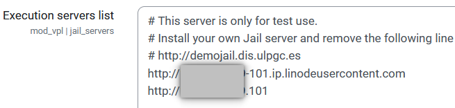


---


<div class="w3-margin w3-padding-large w3-xxlarge w3-display-left">

# How did we get our own Jail server??? 
  
* VirtualBox servers (housed in our laptops) 
* Local (LAN) servers here.
* Cloud servers!  :)

</div>


---

# https://www.linode.com

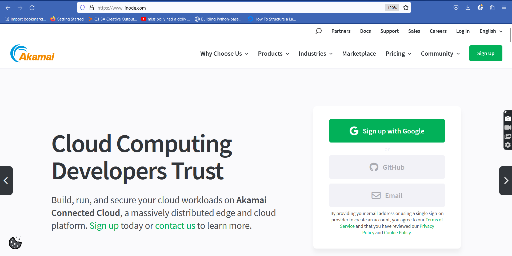

---

# 1 CPU, 2GB RAM, 50GB Storage 

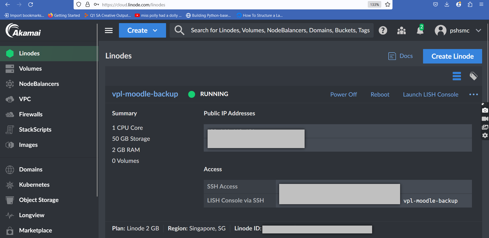

---

# Ubuntu; Sg = $12 USD / mo.

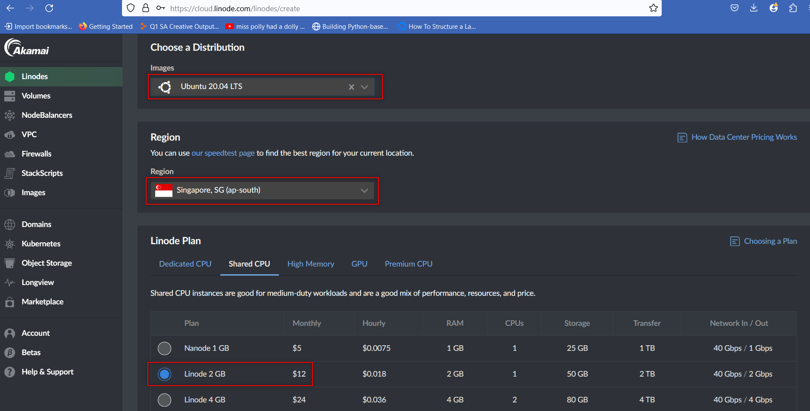

---

# Getting VPL-Jail-System


1. Enter your server 
    * install Visual Studio Code and use the terminal there Open VSCode and press Ctrl-` (i.e. control backtick) 
    * `ssh root@<your-server-ip>`
2. Download the system:
 `wget https://vpl.dis.ulpgc.es/releases/vpl-jail-system-4.0.2.tar.gz`
3. Unzip the installer:
  `tar xvf vpl-jail-system-4.0.2.tar.gz`

---


# Installing the VPL-Jail-System for the first time:


1. Go to the installer directory 
    `cd vpl-jail-system-4.0.2`
2. Run the installer as root
  `sudo ./install-vpl-sh full start`
---


<div class="w3-container w3-black w3-center" style="position: absolute; top: 50; left: 50;">
  <p class="w3-text-white" style="font-size: 50px; font-family: 'Courier New', monospace;">04</p>
</div>


<div class="w3-display-middle w3-xxlarge">
  
  # VPL config of  Philippine Science High School - MC
</div>


---


# Tips for installing for the first time: 

* say yes to **LetsEncrypt**  
* put in your **email** when asked for
* type in the given **fully qualified domain name** when asked for (e.g. from Linode)
* say **no** to Kotlin   
* say **no** to JGrasp  
* then make sure to **accept the connections to VPL** when the browser directs you to
> also go to the Local Execution Server, type a space in the box and then hit save. 

---


# If not using cron, run the following every 1 to 2 months

 ```
systemctl status vpl-jail-system.service
systemctl restart vpl-jail-system.service

cd ~
cd vpl-jail-system-4.0.2
./install-vpl-sh full noninteractive start
```

* This will renew your Let's Encrypt SSL certificate
* You can run the code sooner if notice any problems with the VPL Jail Server
* prepare to wait a bit, but the terminal should show you how things are going.

---


# What it means:
# -
## `./install-vpl-sh full noninteractive start`
# -

* **full** means to install all the languages it fully supports
* **noninteractive** means to NOT ask you to do anything
* **start** means to start the server once the installation is finished

---


# Automating daily VPL service restart

* To set up a cron job to restart a service every day on Ubuntu 20.04
    ` crontab -e`
* In the crontab file, to restart the service every day at 3:00 AM, you can use:


`0 3 * * * systemctl restart vpl-jail-system.service `

>  When setting up cron jobs, it's important to ensure that the user running the cron job has the necessary permissions to restart the service.

---


# Automatically restart the server weekly

* The VPL jail server service will automatically run when after the server restarts

* To automatically restart the server every week in Ubuntu 20.04, you can set up a **cron** job to schedule the restart.

    ` crontab -e`
* In the crontab file, add the following line to schedule the server restart every week:
    `0 0 * * 0 reboot`


---


# Automatically reinstall the VPL jail system monthly

* To automatically reinstall the VPL jail system from the installer every month in Ubuntu 20.04, you can set up a **cron** job to schedule the reinstall.

    ` crontab -e`

* In the crontab file, add the following line to schedule the system reinstall on the first day of every month:

```
0 0 1 * * cd ~; cd vpl-jail-system-4.0.2; ./install-vpl-sh full noninteractive start
```

> no need to do any manual commands at this point

---


# Add the server address to your list of VPL Execution servers

* We simply use the IP address 

```
http://xxx-xxx-xxx-101.ip.linodeusercontent.com
http://xxx.xxx.xxx.101
```

# __

<div class="w3-center">


</div>

---


<div class="w3-display-middle">

#  VPL should now be **ready for class**.  :)

</div>

---

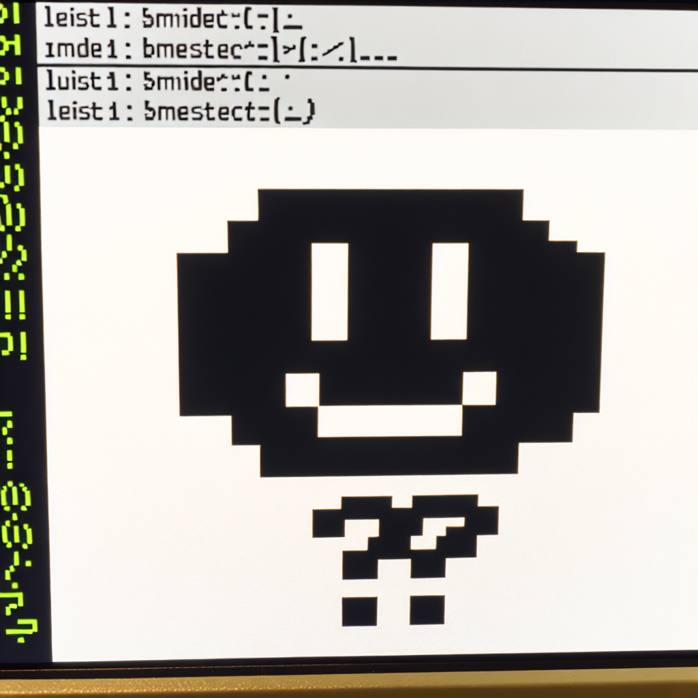


<div class="w3-xxxlarge">

# Thanks!

### Do you have any questions?

#### __

roy@pshs.edu.ph

</div>


---


# Resources

* AI-gen picture: **Leonardo AI**. 2024. https://app.leonardo.ai/ai-generations
* AI-gen picture: **Cici AI**. 2024. https://www.ciciai.com/chat
* icons: **Font Awesome**. 2024. https://fontawesome.com/v6/
* Slides template was created by **Slidesgo** , ported to **Marp**

---


<div class="w3-container w3-black w3-center" style="position: absolute; top: 50; left: 50;">
  <p class="w3-text-white" style="font-size: 50px; font-family: 'Courier New', monospace;">0X</p>
</div>


<div class="w3-display-middle w3-xxlarge">
  
  # Extra slides for Workshop
</div>


---


# Creating Programming Assignments with Moodle VPL

- Step-by-step guide on how to create programming assignments using the plugin
- Defining programming tasks, requirements, and constraints
- Setting up programming languages, libraries, and compiler options
- Configuring evaluation criteria and grading methods
- Demonstrating the use of test cases and expected outputs

---

# Student Experience with Moodle VPL

- Walkthrough of the student view and interface in the Moodle VPL activity
- Accessing and understanding the programming assignment
- Writing and submitting code within the web-based programming environment
- Running and testing code in the secure sandbox environment
- Receiving immediate feedback and evaluation results

---

# Best Practices and Tips for Using Moodle VPL

- Sharing effective strategies for designing and implementing programming assignments
- Providing tips for instructors to enhance student engagement and learning outcomes
- Addressing common challenges and how to overcome them
- Highlighting success stories and case studies from other institutions

---


# Conclusion

- Recap of the key points covered in the talk
- Encouraging further exploration and adoption of the Moodle VPL plugin
- Thanking the audience for their participation and attention
